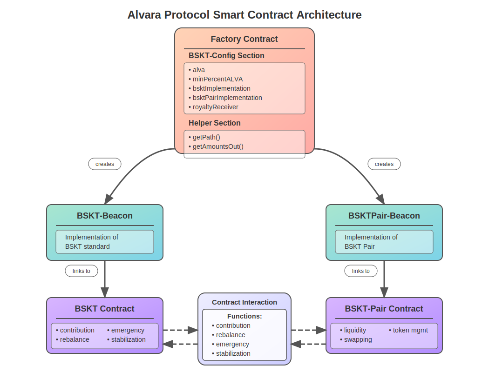

# ALVARA 

## Overview
Welcome to the Alvara Protocol smart contract repository. Alvara uses ERC-7621 standard. The ERC-7621 is a new token standard that introduces a range of powerful functionalities designed to revolutionize the way we manage funds. Experience a new era of investment flexibility, portfolio management simplicity, enhanced liquidity, and complete transparency.
The project includes multiple smart contracts, which are organized and documented for easy understanding and use.
For further details review [Contract Documentation](./docs/ERC-7621.md)

## Prerequisites
Before setting up the project, ensure you have the following installed:

- Node.js (v16.x or higher)
- npm (v6.x or higher)
- Hardhat
- Metamask or any other Ethereum-compatible wallet


## Smart Contracts



### ALVA
**Description:** The main token of the Alvara ecosystem. It is an ERC-20 compliant token that serves as the primary currency for transactions within the platform.
[Contract Documentation](./docs/ALVA.md)

### ALVAAvax
**Description:** A wrapped version of ALVA, deployed on the Avalanche network. It enables cross-chain interoperability for the ALVA token.
[Contract Documentation](./docs/ALVAAvax.md)

### BSKT (Basket Token Standard)
**Description:** This contract manages the basket created by the manager and handles the tokens within the basket. It implements ERC-7621 standard and includes buffer parameters to protect against price slippage during token swaps.
[Contract Documentation](./docs/BSKT.md)

### BSKTPair
**Description:** This contract handles the creation and management of liquidity pairs within the Alvara ecosystem. It implements ERC20 for LP tokens, uses a Beacon Proxy upgradeability pattern, and includes a management fee mechanism.
[Contract Documentation](./docs/BSKTPair.md)

### Factory
**Description:** The Factory contract is responsible for deploying and managing instances of BSKT and BSKTPair contracts. It acts as the central point for creating new liquidity pairs.
[Contract Documentation](./docs/Factory.md)


### Contract Addresses and Environments
Below is a table summarizing the smart contracts, their addresses, and the environments where they are deployed:

| Contract Name | Address                                       | Environment   | Network   |
|---------------|-----------------------------------------------|---------------|-----------|
| Router        | `0x73f19dECFd263f09139c5A4DEe9B5aBc535828DF`  | All           | Sepolia   |
| WETH          | `0xD26d007552DC4733Ce9Cd309c9c3cf6987140883`  | ALl           | Sepolia   |
| ALVA          | `0x0fc4580f70C517B148a141f3721C5138f74401b1`  | Dev           | Sepolia   |
| ALVA          | `0x0fc4580f70C517B148a141f3721C5138f74401b1`  | QA            | Sepolia   |
| ALVA          | `0x0fc4580f70C517B148a141f3721C5138f74401b1`  | Staging       | Sepolia   |
| ALVA          | `0x0fc4580f70C517B148a141f3721C5138f74401b1`  | Production    | Sepolia   |
| ALVA          | `0xabcdefabcdefabcdefabcdefabcdefabcdefabcd`  | Mainnet       | Etheruem  |
| ALVAAvax      | `0x53ca8E73cbE1444B05d8D5b5B825aa7347a4df8D`  | Dev           | Fuji      |
| ALVAAvax      | `0xd18555A6C2FDa350069735419900478eec4Abd96`  | Production    | Avalanche |
| BSKT          | `0x9045B7Ed32E07d02795A60eEF7630B2BE7204814`  | Dev           | Sepolia   |
| BSKT          | `0x895d7395d187F99C00f8f0E2036bCDA996411FAd`  | QA            | Sepolia   |
| BSKT          | `0x4Ff546e844D812A8e1Fff2816346Eb0994433F1D`  | Staging       | Sepolia   |
| BSKT          | `0x81859AdCFB94Dc2f829F02823D460E30Ac89A41c`  | Production    | Sepolia   |
| BSKTPair      | `0x2F757B816066Ecd4128481A17B3cd59072A50B1f`  | Dev           | Sepolia   |
| BSKTPair      | `0x0E26495651A2531a56F6ABDf9119Be1986Cf0A8b`  | QA            | Sepolia   |
| BSKTPair      | `0xa4A2637FA4aC628b4FaeBB9AC730A5C28dc9C16f`  | Staging       | Sepolia   |
| BSKTPair      | `0x9b6441C9597cF2eD37c7343436A9C551E57A9E7d`  | Production    | Sepolia   |
| Factory       | `0xC0A098fee6f2c1EB235EE21Ae079633b4A4AdA0f`  | Dev           | Sepolia   |
| Factory       | `0xb88ce78Bf350e799A7F8D83d4eDE794d3025c472`  | QA            | Sepolia   |
| Factory       | `0xE09e2CF06dcC87a3fad99d62CA07044C138DD790`  | Staging       | Sepolia   |
| Factory       | `0x547c0De08E6E46cE433b009c7Da1431E94a3D70D`  | Production    | Sepolia   |


## Setup

### Installation
Clone the repository and install the dependencies:

```bash
    git clone https://github.com/Alvara-Protocol/alvara-contracts.git
    cd alvara-contracts
    npm install
```


### Configuration
1. Rename the `.env.example` file to `.env`:
    ```bash
        cp .env.example .env
    ```

2. Add your private keys, Infura/Alchemy URLs, and other required environment variables to the .env file.


### Compiling Contracts
Compile the smart contracts using Hardhat:    
```bash    
    npx hardhat compile    
```

### Deploying Contracts
Deploy the contracts to a network (e.g., Mainnet, Avalanche, Sepolia):
```bash    
    npx hardhat deploy --tags all-eth --network sepolia   
```

### Running Scripts
You can interact with the deployed contracts using custom scripts provided in the scripts/ directory. 
```bash    
    npx hardhat run script ./scripts/transfer_ownership.js --network sepolia   
```

### Testing
To run the tests:
```bash    
    npx hardhat test   
```


## Directory Structure
Below is the directory structure of the project:
```
├── contracts/ # All smart contracts of Alvara protocol
| |
│ ├── Interfaces/ # Includes all interfaces using in the smart-contracts 
│ ├── Mock/ # Includes all mock contracts e.g: Alva token utility token for Alvara
│ ├── tokens/  
| | |
| | ├──── Alvara.sol # ERC-20 token used in Alvara protocol as utility token
| | ├──── AlvaraAvax.sol # ERC-20 token used in Alvara protocol as utility token. For Avalanche network
| | └──── BSKTPair.sol # ERC-20 token used as LP token for BSKT.
| |
│ ├── utils/ 
| | |
| | ├──── Constants.sol # Contains all constant values used in the smart-contracts
| | ├──── Error.sol # Contains all the custom erros used in smart-contracts
| | ├──── Helper.sol # Helper methods e.g: Uniswap's method used in smart-contracts
| | ├──── WithSupervisedTransfers.sol # Contract to manage or supervised token ALVA for liquidity 
| | └──── WithSupervisedTransfersAvax # Contract to manage or supervised token ALVA for liquidity on Avalanche network 
| |
│ ├── BSKT.sol # Basket Token Standard contract 
│ ├── Factory.sol # Factory contract to create and manage BSKT and BSKTPair contract
│ └── AlvaraDao.sol # DAO smart-contract for Alvara
|
├── deploy/ # Include all deployment scripts with proper sequence
| |
│ ├── mocks/ # Include all deployment script for mocked contracts
| ├── 01-deploy-alva-eth-token.js # deployment script for alva token on eth network
| └── 01A-deploy-alva-avax-token.js # deployment script for alva token on avalanche network
|
├── docs/ # Include all document files for Alvara protocol
|
├── scripts/ # Custom scripts for interacting with contracts
| |
│ ├── axelar/ # Include all scripts and utils for Axelar integration
| | |
| | ├──── utils # Contains all helping material for axelar integration e.g: ABI files for token contracts and ITS contract
| | ├──── alva_ether_token_interaction_1.js # script for register and cross-chain communication of alva token via axelar
| | └──── mainnet_alva_ether_token_interaction_1.js # script for register and cross-chain communication of alva token via axelar mainnet
| |
│ ├── get_implementation.js # Script to get proxy contract implementation
│ ├── revoke_ownership.js # Script to revoke ownership of alva token
│ └── transfer_ownership.js # Scrpt for transfer ownership of alva token
|
├── test/ # Test scripts for unit testing contracts
| |
│ ├── AlvaDao.js # Unit tests for DAO contract
│ ├── AlvaraAvax.test.js # Unit tests for Alva token (Avalanche token)
│ └── test-case.js # Unit tests for all contracts
|
├── utils/ # Helping or supporting scripts common for all type of projects
| |
│ ├── decode_data.js # Decode data given in the error message, used to trace or debug the issue 
│ └── verify.js # Verify script to verify smart-contract on explorer
|
├── .env # Environment variables (use for private keys, API URLs)
├── .env.example # Example file Environment variables 
├── .gitignore # file used to exclude some files to upload on repository
├── .solcover.js # cofig file for solc to include or exclude for compile
├── gas-repoter.txt # show the gas analyse of smart-contract methods
├── hardhat.config.js # Hardhat configuration
├── helper-hardhat.config.js # Supporting file to manage multiple environment and their values
├── package.json # NPM package file
├── package-lock.json # NPM lock file
└── README.md # Project documentation (this file)
```


## Contribution
We welcome contributions from the community to improve and expand the Alvara platform. If you're interested in contributing, please read our [Contribution Guidelines](./docs/Contribution.md) to understand how to get started.

## Security Considerations
The Alvara Protocol implements several security measures across its contracts:

1. **Access Control**: Role-based access control through OpenZeppelin's AccessControl and Ownable patterns.
2. **Reentrancy Protection**: Custom reentrancy guards for both state-changing and read-only functions.
3. **Buffer Parameters**: All swap operations include buffer parameters (1-4999) to protect against price slippage and front-running attacks.
4. **Safe Token Transfers**: Uses OpenZeppelin's SafeERC20 library for secure token transfers.
5. **Upgradeability**: Beacon Proxy pattern allowing contract upgrades without state loss.
6. **Input Validation**: Extensive validation for all function parameters to prevent invalid states.

For more detailed security information, refer to the individual contract documentation.
